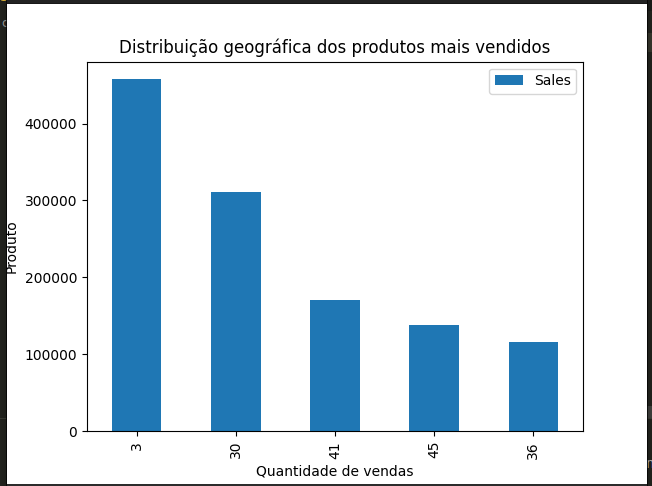

<a id='ancora'></a>
# Fadesp

<br>
This is a challenge by FADESP

<br>


<br><br>

- [Sobre a FADESP](#ancora1) <br>
- [Sobre o Desafio](#ancora2) <br>
- [Sobre o Projeto](#ancora3) <br>
- [Requisitos Obrigatórios](#ancora4) <br>
- [Execução](#ancora5) <br>
- [Desenvolvedora](#ancora6)

<br><br>

<a id="ancora1"></a>

## Sobre a FADESP

<br>


<br>

A FADESP é uma instituição de direito privado, sem fins lucrativos, que tem como objetivo apoiar o desenvolvimento científico, social e tecnológico da Amazônia. Criada em 1977 para dar suporte às atividades da Universidade Federal do Pará (UFPA), atualmente, é um dos grandes agentes estratégicos da região Norte.

<br>

<a id="ancora2"></a>

## Sobre o Desafio

<br>

Realizar a extração de dados, manipular através do Phython e tratar os dados ali contidos.
<br>

Criar um dashboard para viasulizar os dados.

<br>

<a id="ancora3"></a>
## Sobre o Projeto

<br>

O projeto foi criado através do phyton com pandas, a manipulação dos dados foi utilizado o SQLite para criação do banco de dados.

<br>

Para este projeto foram utilizadas as seguintes tecnologias:

<br>

* 

* 


<br>

<a id="ancora4"></a>
## Requisitos Obrigatórios

<br>

### Requisito 1
* Baixe a base de dados completa e carregue dentro de DataFrame do pandas.


<br>

### Requisito 2
* Realize um processo limpeza nos dados removendo ou substituindo os valores nulos quando necessário, e eliminando dados duplicados e inconsistentes caso exista algum.

    

### Requisito 3
* Tabela para avalição de vendas.
 
     <p align="center">
    
    </p>

<br>


<a id="ancora5"></a>
## Execução 

<br>

1. Clone este repositório remoto em seu equipamento:
```
git clone git@github.com:Karolinegaia/desafio-fadesp-processo-seletivo.git
```

2. Acesse a pasta do projeto:
````
cd desafio-fadesp-processo-seletivo
````

3. Abra o VSCode ou IDE de sua preferência:
````
code .
````

4. Entre na branch main
````
git checkout main
````


<br>

<a id="ancora6"></a>
## Desenvolvedora

Projeto desenvolvido por:

<table align="center">
  <tr>
    <td align="center">
      <a target="_blank" href="https://www.linkedin.com/in/karoline-gaia-alexandre/">
        <br>
        <sub>
          <b>Karoline Gaia Alexandre</b>
           <p>Desenvolvedora</p>
        </sub>
      </a>
    </td>
  </tr>
</table>

<br><br>

[Voltar ao Topo](#ancora)